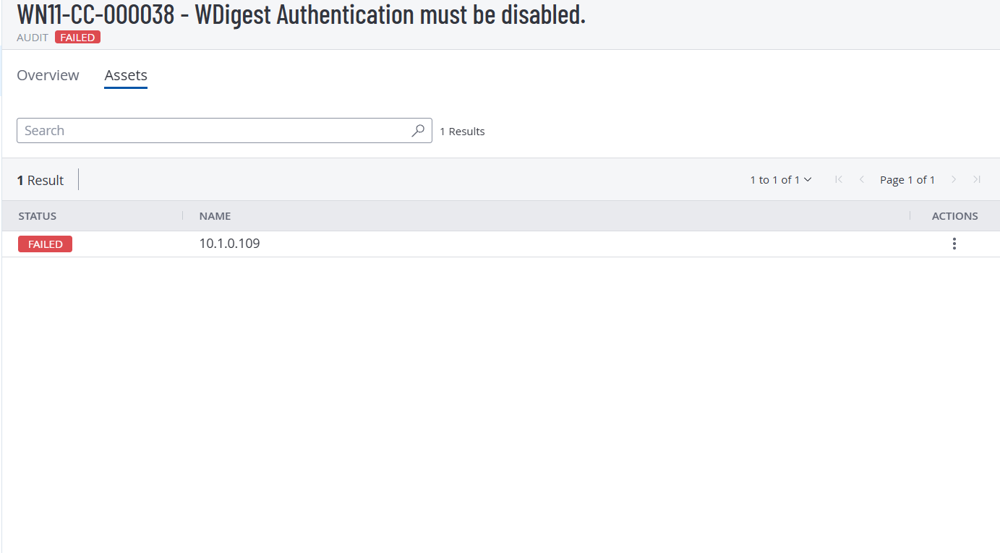
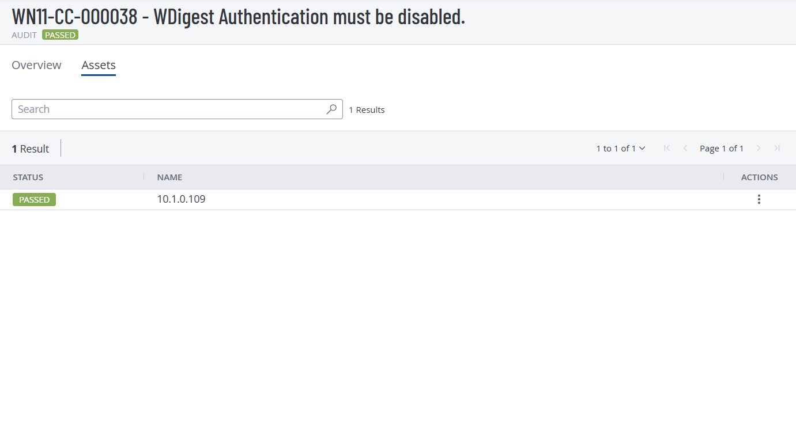
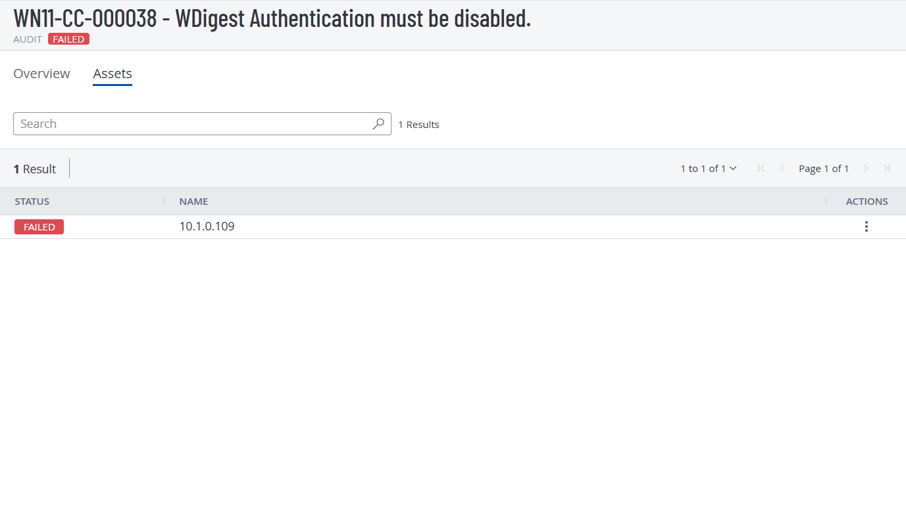
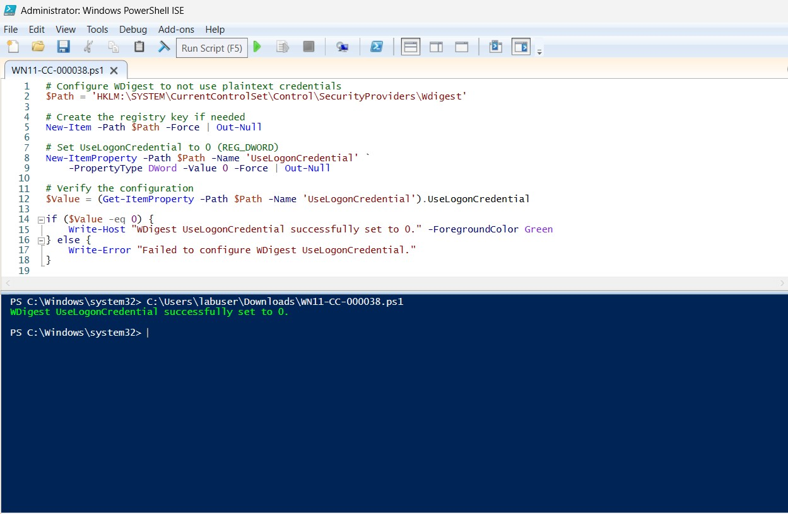
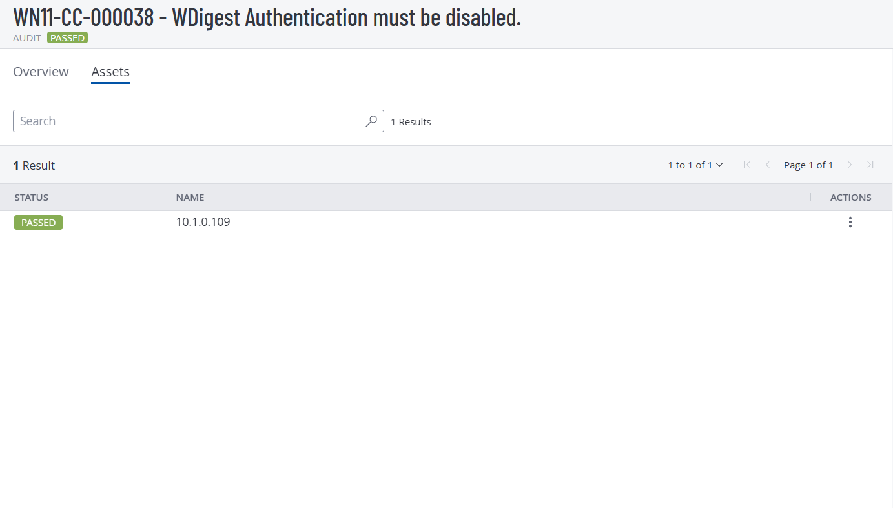

# WN11-CC-000038 — WDigest Authentication

## Overview

| Item | Value |
|---|---|
| STIG ID | WN11-CC-000038 |
| Severity | CAT II / Medium |
| CCI | CCI-000381 |
| Vulnerability ID | V-253358 |
| Platform | Windows 11 |
| Test Date | 2026-08-17 |
| PowerShell | Windows PowerShell 5.1 |
| Validation | Tenable |

## Security Context

WDigest Authentication can cause plaintext credentials to be stored in LSASS memory. This can increase the risk of credential theft.

This STIG ensures that WDigest plaintext credential use remains disabled.

## Requirement

WDigest Authentication must be disabled.

Required registry configuration:

| Setting | Value |
|---|---|
| Hive | `HKEY_LOCAL_MACHINE` |
| Path | `SYSTEM\CurrentControlSet\Control\SecurityProviders\Wdigest` |
| Value Name | `UseLogonCredential` |
| Type | `REG_DWORD` |
| Data | `0` |

## Initial Assessment

The Windows 11 VM was scanned using the Windows 11 STIG Audit Policy.

**Initial result: FAIL**



## Manual Remediation

The STIG requires the following Group Policy setting:

**Computer Configuration → Administrative Templates → MS Security Guide → WDigest Authentication → Disabled**

The MS Security Guide template was not initially available.

The required STIG GPO package was used to obtain the required templates:

```text
SecGuide.admx → C:\Windows\PolicyDefinitions\
SecGuide.adml → C:\Windows\PolicyDefinitions\en-US\
```

The policy was then configured manually.

**Result: PASS**



## Reversion Test

The manual remediation was reverted and the system was rescanned.

**Result: FAIL**

This confirmed that the configured security setting directly affected the STIG check.



## PowerShell Remediation

The configuration was automated using PowerShell by setting `UseLogonCredential` to `0`.

See [`WN11-CC-000038.ps1`](WN11-CC-000038.ps1).



## Local Verification

The registry configuration was verified locally:

```powershell
Get-ItemProperty -Path 'HKLM:\SYSTEM\CurrentControlSet\Control\SecurityProviders\Wdigest' -Name 'UseLogonCredential'
```

Expected result:

```text
UseLogonCredential : 0
```

## Tenable Validation

The system was rescanned with Tenable after the PowerShell remediation.

**Final result: PASS**



## Result

**WN11-CC-000038 successfully remediated and validated.**
